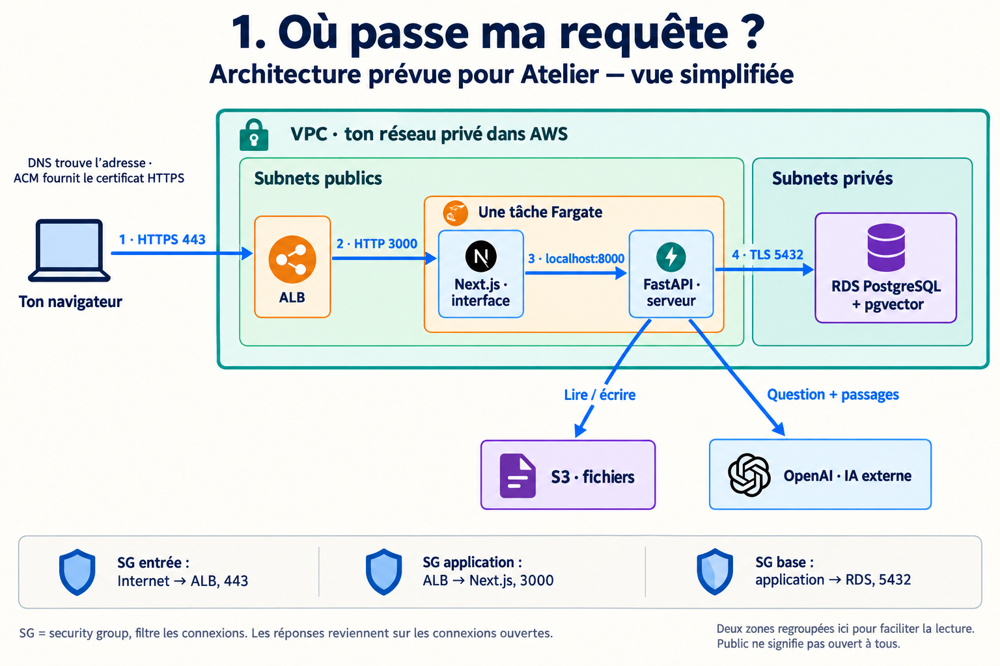
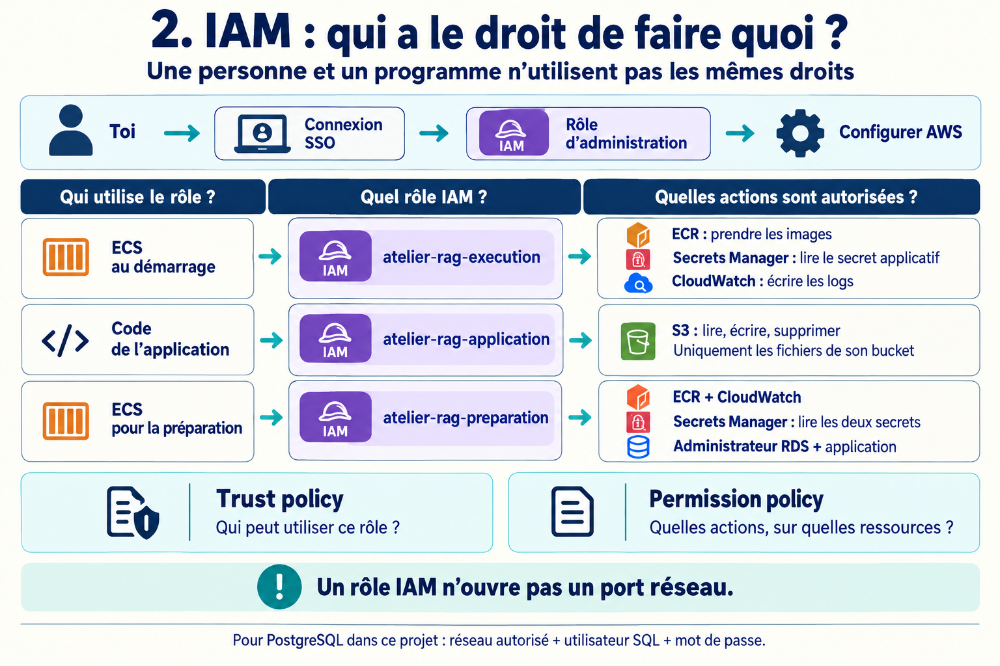
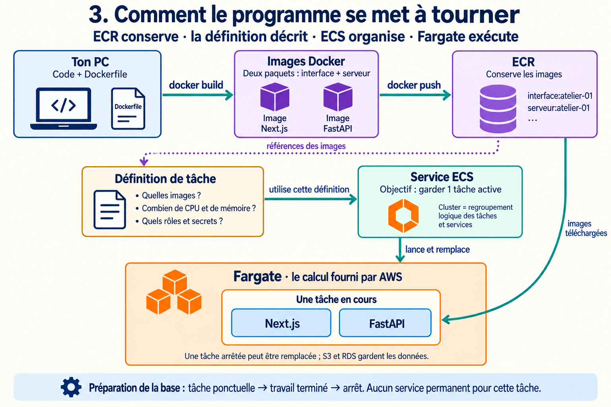

# Comprendre ton installation AWS avec trois schémas

Tu as créé plusieurs éléments dans AWS. Pour comprendre l’ensemble, suis **une seule application**, Atelier, et pose trois questions : **où passe sa demande ? Qui l’autorise ? Qu’est-ce qui fait tourner le programme ?**

Les images représentent l’architecture du projet, pas une vérification de ton compte AWS. Clique dessus pour les agrandir sur GitHub. Les [six premières étapes du guide pratique](deployer-sur-aws.md) expliquent comment construire ces éléments.

## 1. Où sont les éléments et comment communiquent-ils ?

Le cloud, ici, c’est louer chez AWS les moyens de faire tourner Atelier et de conserver ses données. Ton ordinateur sert à préparer le code et à administrer AWS. Une fois déployée, l’application peut fonctionner même si tu éteins ton ordinateur.

**Lis les cadres avant les flèches.** Ton compte possède les ressources. Tu choisis la région Paris. Dans cette région, le **VPC** délimite ton réseau ; un **subnet** est une partie de ce réseau. La tâche Fargate et RDS ont chacun une adresse dans leur subnet.

La grande boîte orange contient **ton application en cours d’exécution** : une tâche Fargate avec deux conteneurs. Next.js affiche le site ; FastAPI traite les documents et les questions. Ils partagent le réseau de la tâche et se parlent par `localhost`, c’est-à-dire « ici, dans cette même tâche ».

**Suis maintenant une question de gauche à droite :**

1. Tu ouvres le site. Le **DNS** aide le navigateur à trouver l’adresse de l’**ALB**, le load balancer. Le certificat fourni par **ACM** permet la connexion HTTPS.
2. L’ALB reçoit la demande et la transmet à **Next.js**, dans une tâche qui répond correctement. Il peut diriger vers une tâche de remplacement quand ECS en lance une nouvelle.
3. Next.js transmet la question à **FastAPI**.
4. FastAPI utilise **OpenAI** pour calculer l’embedding de la question, recherche les passages proches dans **RDS PostgreSQL/pgvector**, puis demande à OpenAI de rédiger la réponse avec ces passages.
5. La réponse revient jusqu’à ton navigateur. **S3**, de son côté, conserve les fichiers importés ; RDS conserve les textes, embeddings et conversations.

Les nombres `443`, `3000`, `8000` et `5432` sont des **ports** : ils indiquent à quel programme adresser une connexion. Les **security groups** filtrent les connexions autorisées, par exemple « accepter le port 3000 seulement depuis l’ALB ».

### Pourquoi public et privé ?

Un subnet public possède une route vers Internet via l’**Internet Gateway**. La route indique le chemin ; le security group autorise ou refuse la connexion. Dans ce projet, la tâche a une IP publique pour ses appels sortants, mais ses règles d’entrée n’acceptent que l’ALB sur le port 3000. **Public ne veut donc pas dire accessible à tout le monde.**

RDS est dans un subnet privé : FastAPI le rejoint par le réseau interne du VPC. S3 est un service AWS situé hors de tes subnets ; cela ne rend pas ton bucket public. Le projet le rejoint via un endpoint S3, un accès prévu depuis le VPC.

*Pour alléger l’image, les deux zones sont regroupées. En pratique, tu crées deux subnets publics et deux privés. L’ALB utilise les deux zones ; une tâche tourne dans un seul subnet à la fois et ta base Single-AZ n’a qu’une instance active.*

## 2. Où interviennent les droits IAM ?

**Le réseau répond : « peut-on établir la connexion ? » IAM répond : « cette identité peut-elle effectuer cette action AWS ? »** Pouvoir joindre S3 ne donne pas automatiquement le droit de lire ses fichiers.

Lis chaque ligne de gauche à droite : **qui agit → avec quel rôle → pour faire quoi**.

Quand **toi** tu ouvres la console avec SSO, AWS utilise ton rôle d’administration. Quand **le programme** tourne, il utilise les rôles configurés pour lui. **Il n’hérite pas de tes droits personnels.**

Un **rôle** est une identité utilisable temporairement. Une **permission policy** est sa liste d’actions autorisées sur des ressources précises. Exemple : « lire les fichiers de ce bucket ». Une **trust policy** précise qui peut utiliser le rôle ; ici, les rôles des tâches font confiance au service ECS Tasks.

Les trois rôles du projet ont des missions différentes :

- **Exécution** : ECS prend les images dans ECR, charge le secret applicatif depuis Secrets Manager et écrit les logs dans CloudWatch.
- **Application** : le code peut lire, écrire et supprimer les fichiers de son bucket S3. Ces permissions appartiennent à la tâche ; FastAPI les utilise pour le stockage.
- **Préparation** : ECS peut charger les deux secrets pour la tâche qui prépare PostgreSQL. Les droits administrateur **dans PostgreSQL** viennent ensuite du compte SQL et de son mot de passe, pas du rôle IAM lui-même.

Un **ARN** identifie précisément une ressource dans une permission ou une configuration. Ce n’est pas sa clé secrète.

### Exemple : pourquoi une connexion à RDS peut échouer

Trois conditions doivent fonctionner ensemble : ECS peut **lire le secret**, le réseau **autorise FastAPI à joindre RDS**, puis PostgreSQL **accepte le compte SQL et son mot de passe**. Corriger IAM ne corrige pas un mauvais port ; ouvrir un port ne corrige pas un mauvais mot de passe.

## 3. Que font ECR, ECS et Fargate ensemble ?

**Lis du haut vers le bas.** Tu construis deux **images Docker** sur ton PC : des paquets contenant le programme et ses dépendances. Tu les envoies dans **ECR**, qui les conserve. À ce stade, aucun site ne tourne grâce à ce seul envoi.

La **définition de tâche** décrit comment démarrer ces images : mémoire, CPU, rôles et secrets. Le **service ECS** utilise cette fiche avec une consigne : « garder une tâche active ». **Fargate** fournit le calcul et la mémoire pour exécuter cette tâche. Le **cluster ECS** regroupe les services et les tâches pour les gérer.

La tâche ponctuelle de **préparation** utilise une autre fiche : elle prépare pgvector et les tables, puis s’arrête. Le service du **site**, lui, remplace une tâche qui disparaît tant que sa consigne reste à une tâche active.

**Voilà pourquoi les données sont ailleurs :** remplacer une tâche ne doit pas effacer les fichiers S3 ou la base RDS. Une nouvelle tâche retrouve les mêmes données. Et pour arrêter le site, tu règles le service à **zéro tâche** ; fermer le navigateur ne suffit pas. Consulte la [fiche d’arrêt](apprendre-aws/08-arreter-reprendre-supprimer.md) pour les autres services et leurs coûts.

## Relier tes manipulations à leur résultat

Quand tu configures les **subnets et routes**, tu choisis où placer les ressources et leurs chemins. Avec les **security groups**, tu autorises les connexions. Avec **IAM**, tu autorises les actions AWS. Avec **ECR**, tu fournis le programme. Avec **ECS/Fargate**, tu le fais fonctionner. Avec **ALB, DNS et HTTPS**, tu permets au navigateur de le trouver et de lui parler.

Pour t’entraîner, explique en suivant les images : « J’importe un PDF : mon navigateur parle à l’ALB, puis à Next.js, puis à FastAPI. FastAPI écrit le fichier dans S3 grâce au rôle applicatif et enregistre ses informations dans PostgreSQL grâce à sa connexion SQL. »

*Références pour approfondir : [réseau Fargate](https://docs.aws.amazon.com/AmazonECS/latest/developerguide/fargate-task-networking.html), [subnets](https://docs.aws.amazon.com/vpc/latest/userguide/configure-subnets.html), [rôle IAM de tâche](https://docs.aws.amazon.com/AmazonECS/latest/developerguide/task-iam-roles.html). Les [consignes de création des images](schemas/aws/consignes-images.md) sont conservées avec le document.*
