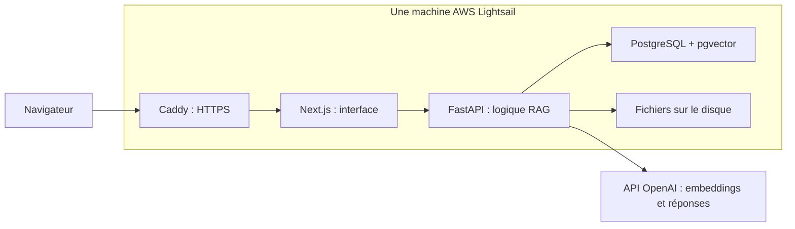

# Déployer Atelier sur AWS, pas à pas

Ce guide part de zéro : vous avez un compte AWS, mais aucun service actif. **Vous pouvez tout faire en local aujourd’hui. Rien dans ce dépôt ne crée automatiquement de ressource AWS.**

Le choix proposé pour une petite démonstration : **une machine Lightsail à 12 USD/mois, qui héberge Next.js, FastAPI et PostgreSQL/pgvector**, puis **l’API OpenAI à l’usage**. Ollama reste sur votre ordinateur.

Les tarifs ci-dessous ont été vérifiés le **8 septembre 2026**. Ils sont en dollars, **hors taxes**, sans supposer de crédits gratuits. Votre facture dépendra de votre usage, de votre pays de facturation et des futurs tarifs. Le taux de change bancaire n’est pas inclus.

## 1. Comprendre ce que vous louez

Pensez à Lightsail comme à un ordinateur distant qui reste allumé. Docker y lance les différentes parties du projet.



| Élément | À quoi il sert | Mon choix au démarrage |
|---|---|---|
| Lightsail | L’ordinateur qui héberge le projet | Linux, Ubuntu 24.04 LTS, 2 Go de RAM, IPv4 |
| PostgreSQL + pgvector | Les documents, vecteurs et conversations | Un conteneur sur cette machine |
| Disque de la machine | Les fichiers PDF, Markdown et images | Volume Docker persistant inclus dans le disque |
| Caddy | L’entrée HTTPS du site | Conteneur gratuit, certificats automatiques |
| OpenAI API | Calcul des embeddings et rédaction | `text-embedding-3-small` + `gpt-4o-mini` |
| Mistral OCR, facultatif | Lecture des PDF scannés et tableaux | `mistral-ocr-latest`, uniquement sur action dans le Studio |
| AWS Budgets | Vous prévenir d’une hausse de facture | Budget mensuel et alertes par email |
| Snapshots Lightsail | Sauvegarde de la machine | Petit volume conservé, à surveiller |

**Pourquoi pas RDS tout de suite ?** RDS gère une base à votre place, mais ajoute une facture distincte. Pour ce petit projet, PostgreSQL sur Lightsail réduit le coût et garde l’installation facile à comprendre. En échange, vous gérez les sauvegardes. Cette installation personnelle n’offre pas de haute disponibilité : si la machine tombe, le site est temporairement indisponible.

Vous n’avez besoin ni d’EKS, ni d’un load balancer, ni d’un NAT Gateway, ni d’une machine GPU pour cette architecture. S3 et RDS restent des évolutions possibles, expliquées à la fin.

## 2. Combien cela devrait coûter

Le forfait Linux IPv4 **2 Go / 60 Go de disque / 3 To de transfert** est affiché à **12 USD/mois**. Le forfait **1 Go / 40 Go** coûte **7 USD/mois**, mais laisse moins de marge pour les PDF et les imports. Je conseille 2 Go pour démarrer sereinement ; 1 Go peut se tester avec un corpus minuscule, des images préconstruites et du swap. Je n’ai pas mesuré cette application sur une instance Lightsail 1 Go. [Forfaits officiels](https://docs.aws.amazon.com/lightsail/latest/userguide/amazon-lightsail-bundles.html).

Pour `gpt-4o-mini`, un million de tokens d’entrée coûte **0,15 USD** et un million de tokens de sortie **0,60 USD**. Les embeddings `text-embedding-3-small` coûtent **0,02 USD par million de tokens**. Un token est un petit morceau de texte ; le contexte, les consignes et l’historique font aussi partie de l’entrée facturée. [Génération](https://developers.openai.com/api/docs/models/gpt-4o-mini), [embeddings](https://developers.openai.com/api/docs/models/text-embedding-3-small).

Les snapshots Lightsail coûtent **0,05 USD par Go et par mois**. Les 5 Go ci-dessous sont une **hypothèse de volume total facturé**, pas une garantie sur la taille d’un snapshot de votre disque. [Tarification des snapshots](https://aws.amazon.com/lightsail/pricing/).

Hypothèses : Standard RAG, 3 000 tokens d’entrée et 500 tokens de sortie par réponse, 50 tokens par question à transformer en embedding, un million de tokens de documents indexés pendant le mois, 5 Go de snapshots conservés.

| Poste mensuel | 100 questions | 1 000 questions | 5 000 questions |
|---|---:|---:|---:|
| Lightsail 2 Go | 12,00 $ | 12,00 $ | 12,00 $ |
| Snapshots, hypothèse 5 Go | 0,25 $ | 0,25 $ | 0,25 $ |
| Réponses OpenAI | 0,075 $ | 0,75 $ | 3,75 $ |
| Embeddings des documents | 0,02 $ | 0,02 $ | 0,02 $ |
| Embeddings des questions | 0,0001 $ | 0,001 $ | 0,005 $ |
| **Total estimé HT** | **12,35 $** | **13,02 $** | **16,03 $** |

Exemple d’une réponse : `3 000 × 0,15 / 1 000 000 + 500 × 0,60 / 1 000 000 = 0,00075 USD`.

**Si vous utilisez l’OCR Mistral pour les PDF**, le tarif affiché pour `mistral-ocr-latest` est de **4 USD pour 1 000 pages**, soit **0,004 USD/page**. Ajoutez 0,40 USD pour 100 pages ou 4 USD pour 1 000 pages réellement traitées pendant le mois. L’exemple à 1 000 questions et 100 pages OCR revient à **13,42 USD HT**. La facture Mistral est distincte d’AWS et d’OpenAI. Le cache évite une nouvelle facturation pour les pages déjà lues avec le même modèle demandé. [Tarif officiel Mistral](https://mistral.ai/pricing/api/).

Non inclus : achat/renouvellement d’un domaine, éventuels dépassements réseau, S3/RDS optionnels, analyse d’images, appel de décomposition du Branching RAG, embeddings supplémentaires du chunking sémantique, taxes. Une réindexation est une nouvelle consommation d’embeddings. La suppression d’un fichier n’annule pas les appels déjà facturés.

Recalculez avec **votre** usage, depuis la racine du projet sur votre ordinateur :

```powershell
python scripts/estimer_cout.py --questions 1000
python scripts/estimer_cout.py --questions 1000 --pages-ocr 100
python scripts/estimer_cout.py --questions 200 --tokens-entree 5000 --tokens-sortie 800 --tokens-indexation 200000 --go-snapshots 10
```

Les hypothèses et liens tarifaires sont dans [`tarifs.json`](tarifs.json). Le calculateur ne contacte aucun service et ne dépense rien.

## 3. Avant de créer la machine

1. Dans votre compte AWS, activez la MFA pour protéger la connexion. Utilisez un accès d’administration dédié pour le travail quotidien.
2. Ouvrez **Billing and Cost Management → Budgets → Create budget**.
3. Créez un **Cost budget**, mensuel, de **15 USD**, couvrant tout le compte. Nommez-le `atelier-rag`.
4. Ajoutez une alerte de dépense réelle à 50 %, 80 % et 100 %, et une alerte de prévision à 100 %. Renseignez votre email et confirmez tout message reçu.
5. Vérifiez régulièrement **Bills** et **Cost Explorer**. Un budget est une alerte, **pas un plafond qui coupe automatiquement les services**, et les données peuvent arriver avec retard. [Créer un budget](https://docs.aws.amazon.com/cost-management/latest/userguide/create-cost-budget.html), [fonctionnement des alertes](https://docs.aws.amazon.com/cost-management/latest/userguide/budgets-managing-costs.html).

OpenAI aura sa propre facture. Dans la plateforme OpenAI, créez un projet dédié à Atelier, ajoutez un petit montant de crédit si cette option est proposée à votre compte, configurez des alertes et évitez la recharge automatique au début. Les budgets de projet sont des alertes ; ne les considérez pas comme une protection absolue contre les dépenses. Utilisez la clé de ce projet uniquement sur le serveur, jamais dans GitHub ni dans le navigateur.

## 4. Créer la machine Lightsail

Dans la console AWS, cherchez **Lightsail**, puis **Create instance**.

1. Région : **Paris (`eu-west-3`)**, si disponible pour votre compte.
2. Plateforme : **Linux/Unix**.
3. Image : **OS only → Ubuntu 24.04 LTS**. Choisissez l’architecture x86_64 pour les images Docker préconstruites dans ce guide.
4. Offre : **2 Go de RAM avec IPv4 publique**, 12 USD/mois au tarif vérifié. Confirmez le montant affiché avant de créer.
5. Nom : `atelier-rag`.
6. Clé SSH : utilisez une clé dédiée et téléchargez le fichier `.pem` proposé. Gardez-le privé sur votre ordinateur.
7. Créez l’instance. La facturation commence dès la création, sous réserve des crédits de votre compte.

Pour commencer sans SSH local, le bouton de connexion du navigateur Lightsail ouvre aussi un terminal Ubuntu.

### Fixer l’adresse IP

Dans **Networking → Create static IP**, créez une IP statique et attachez-la à `atelier-rag`. Elle reste stable lors des redémarrages. L’IP statique attachée est incluse ; une IP laissée détachée peut être facturée. [IP statiques Lightsail](https://docs.aws.amazon.com/lightsail/latest/userguide/understanding-static-ip-addresses-in-amazon-lightsail.html), [facturation](https://docs.aws.amazon.com/lightsail/latest/userguide/amazon-lightsail-frequently-asked-questions-faq-billing-and-account-management.html).

### Régler le pare-feu Lightsail

Dans l’onglet **Networking** de l’instance :

| Port | Qui peut y accéder | Utilité |
|---|---|---|
| TCP 22 | Votre IP publique uniquement | SSH pour administrer |
| TCP 80 | Tout le monde | Création/renouvellement HTTPS et redirection |
| TCP 443 | Tout le monde | Site HTTPS |
| UDP 443 | Facultatif | HTTP/3 |

Appliquez aussi ces choix au pare-feu IPv6, ou désactivez IPv6 si vous ne l’utilisez pas. N’ouvrez pas 3000, 8000, 5432 ou 11434. Le fichier Compose AWS retire leurs ports publics.

## 5. Se connecter depuis Windows

Les commandes de cette section se tapent dans **PowerShell, sur votre PC**. Remplacez les deux valeurs d’exemple.

```powershell
$cleSsh = 'C:\Users\VotreNom\.ssh\atelier-rag.pem'
$ipServeur = 'VOTRE_IP_STATIQUE'
ssh -i $cleSsh "ubuntu@$ipServeur"
```

Si SSH refuse une clé trop accessible, ouvrez les propriétés du fichier `.pem`, puis **Sécurité → Avancé** : retirez l’héritage et limitez la lecture à votre compte Windows. Ne publiez jamais ce fichier.

Lorsque le terminal commence par `ubuntu@...`, vous êtes **sur la machine AWS**. Les commandes suivantes utilisent Bash, le terminal Ubuntu.

## 6. Installer Docker sur Ubuntu

**Sur la machine AWS**, copiez ce bloc :

```bash
sudo apt update
sudo apt install -y ca-certificates curl git
sudo install -m 0755 -d /etc/apt/keyrings
sudo curl -fsSL https://download.docker.com/linux/ubuntu/gpg -o /etc/apt/keyrings/docker.asc
sudo chmod a+r /etc/apt/keyrings/docker.asc
sudo tee /etc/apt/sources.list.d/docker.sources >/dev/null <<EOF
Types: deb
URIs: https://download.docker.com/linux/ubuntu
Suites: $(. /etc/os-release && echo "$VERSION_CODENAME")
Components: stable
Architectures: $(dpkg --print-architecture)
Signed-By: /etc/apt/keyrings/docker.asc
EOF
sudo apt update
sudo apt install -y docker-ce docker-ce-cli containerd.io docker-buildx-plugin docker-compose-plugin
sudo usermod -aG docker "$USER"
exit
```

Reconnectez-vous en SSH, puis vérifiez :

```bash
docker version
docker compose version
```

L’ajout au groupe Docker prend effet à la nouvelle connexion. Compose doit être assez récent pour accepter `!reset` dans la configuration AWS, disponible à partir de Compose 2.24.4. [Installation officielle Docker](https://docs.docker.com/engine/install/ubuntu/).

## 7. Copier le projet et préparer OpenAI

**Sur AWS**, clonez votre dépôt GitHub après l’y avoir envoyé :

```bash
git clone https://github.com/VOTRE_COMPTE/VOTRE_DEPOT.git atelier-rag
cd atelier-rag
cp deploiement/.env.aws.example .env
chmod 600 .env
nano .env
```

Si votre dépôt est privé, utilisez l’accès GitHub de votre choix, sans écrire de token dans une URL ou un fichier suivi par Git. Vous pouvez également transférer une archive du projet par `scp`.

Dans `.env`, remplissez :

```dotenv
FOURNISSEUR_IA=openai
OPENAI_API_KEY=VOTRE_CLE_DU_PROJET_OPENAI
OPENAI_GENERATION=gpt-4o-mini
OPENAI_EMBEDDING=text-embedding-3-small
MISTRAL_API_KEY=VOTRE_CLE_MISTRAL_SI_VOUS_UTILISEZ_OCR
MISTRAL_OCR=mistral-ocr-latest
POSTGRES_PASSWORD=UN_SECRET_HEXADECIMAL
CLE_ACCES=UN_AUTRE_SECRET_HEXADECIMAL
DOMAINE=rag.votre-domaine.fr
EMAIL_TLS=votre-email@example.com
```

Générez **deux secrets différents** avec `openssl rand -hex 32`, puis copiez chacun dans la bonne ligne. `POSTGRES_PASSWORD` protège la base ; `CLE_ACCES` sera la clé d’entrée dans votre interface. Ne la confondez pas avec la clé OpenAI. Dans Nano : **Ctrl+O**, **Entrée**, puis **Ctrl+X** pour enregistrer et quitter.

La configuration OpenAI est prête, mais aucun appel ne part tant que vous ne lancez pas une fonction IA. N’utilisez pas `docker compose config` sans option dans un terminal partagé : il peut afficher les secrets interpolés. Utilisez `config --quiet` pour vérifier sans les afficher.

La clé Mistral est facultative : laissez sa ligne vide pour ne pas utiliser l’OCR distant. Copiez votre clé dans le `.env` AWS seulement si vous souhaitez cette fonction. Elle reste dans FastAPI. Le [guide OCR des PDF](utiliser-ocr-pdf.md) explique l’utilisation ; passer le chat et les embeddings à OpenAI ne change pas ce fournisseur OCR.

## 8. Relier un nom de domaine

Chez le fournisseur de votre domaine, créez un enregistrement DNS :

| Type | Nom | Valeur |
|---|---|---|
| A | `rag` | L’IP statique Lightsail |

Le résultat est `rag.votre-domaine.fr`. Mettez exactement ce nom dans `DOMAINE`, sans `https://`. Vous pouvez garder le DNS chez votre fournisseur : Route 53 n’est pas nécessaire. N’ajoutez un enregistrement AAAA que si vous configurez aussi IPv6 correctement.

Attendez que ce nom pointe vers votre machine. Caddy demandera automatiquement le certificat HTTPS ; les ports 80/443 doivent être accessibles. L’achat éventuel du domaine est une dépense distincte.

**Sans domaine, pour une démonstration privée**, gardez les ports liés à localhost du Compose local sur AWS, passez OpenAI dans `.env`, imposez `ENVIRONNEMENT=production` et `CLE_ACCES`, puis utilisez un tunnel depuis PowerShell :

```powershell
ssh -i $cleSsh -L 3000:127.0.0.1:3000 "ubuntu@$ipServeur"
```

Sur AWS, lancez alors uniquement `docker compose up -d --no-build --wait` après avoir chargé les images de l’étape suivante. Sur votre PC, ouvrez `http://localhost:3000`. Le tunnel chiffre le transport ; cette option n’utilise pas le fichier Compose AWS ni Caddy, et ne constitue pas un site public à partager.

## 9. Construire les images sur votre PC et les envoyer

Construire Next.js consomme momentanément plus de mémoire que l’exécuter. Pour économiser la RAM de Lightsail, préparez les images **sur votre PC Windows**, dans le dossier du projet :

```powershell
docker compose build
docker save -o atelier-images.tar atelier-rag-serveur:latest atelier-rag-interface:latest
scp -i $cleSsh atelier-images.tar "ubuntu@${ipServeur}:/home/ubuntu/atelier-images.tar"
```

Ces images doivent correspondre à l’architecture de votre instance, ici **Linux AMD64**. Sur un Mac ARM, utilisez `docker buildx build --platform linux/amd64 --load -t atelier-rag-serveur:latest serveur` et la même commande pour `interface`.

**Sur AWS**, chargez les images puis démarrez :

```bash
cd ~/atelier-rag
docker load -i ~/atelier-images.tar
docker compose -f compose.yaml -f deploiement/compose.aws.yaml config --quiet
docker compose -f compose.yaml -f deploiement/compose.aws.yaml up -d --no-build --wait
docker compose -f compose.yaml -f deploiement/compose.aws.yaml ps
```

Les migrations PostgreSQL s’exécutent automatiquement au démarrage de FastAPI. Les quatre services doivent démarrer : `base`, `serveur`, `interface`, `entree`.

Ouvrez `https://rag.votre-domaine.fr`. L’interface vous demande **CLE_ACCES**. La clé OpenAI, elle, reste dans le serveur. Les originaux et les visuels sont également protégés par cette authentification.

## 10. Basculer les documents locaux vers OpenAI

**Un embedding Qwen ne peut pas être comparé à un embedding OpenAI.** Changer le nom du modèle ne transforme pas les anciens vecteurs.

Le chemin le plus simple pour votre petit projet :

1. Gardez votre version locale intacte.
2. Sur AWS, ajoutez de nouveau les fichiers ou URL dans **Documentation**.
3. Ouvrez chaque document dans **Chunking**.
4. Générez l’aperçu, vérifiez-le, puis cliquez **Valider et indexer**.
5. Posez une question et inspectez ses sources dans **Pipeline**.

Si vous transférez une sauvegarde complète, vos fichiers et conversations sont conservés, mais **réindexez chaque documentation sur AWS**. Ouvrez le document dans Chunking et validez l’indexation avec OpenAI. L’interface signale les modèles incompatibles ; le backend exclut les anciens espaces d’embedding des résultats. Une ancienne réponse reste consultable grâce à ses instantanés de sources.

Modifier seulement `OPENAI_GENERATION` ne demande pas de réindexation. Modifier `OPENAI_EMBEDDING`, changer de fournisseur d’embedding ou changer réellement le modèle derrière un nom Ollama en demande une.

## 11. Vérifier et dépanner

**Sur AWS**, depuis `~/atelier-rag` :

```bash
docker compose -f compose.yaml -f deploiement/compose.aws.yaml ps
docker compose -f compose.yaml -f deploiement/compose.aws.yaml logs --tail=80 serveur
docker compose -f compose.yaml -f deploiement/compose.aws.yaml logs --tail=80 entree
docker stats --no-stream
df -h
```

| Problème | Ce qu’il faut vérifier |
|---|---|
| Le site ne s’ouvre pas | IP statique, DNS, ports 80/443, logs de Caddy |
| L’interface demande une clé | Utilisez `CLE_ACCES`, pas la clé OpenAI |
| Import réussi, aucune source retrouvée | Document réellement indexé, modèle compatible, technologie/version et seuil |
| Erreur OpenAI | Clé, crédits, accès aux modèles, limites du projet OpenAI |
| Conteneur arrêté avec code 137 | Mémoire insuffisante : imports plus petits, pas de build sur le serveur, surveiller `docker stats` |
| Base inaccessible après changement de mot de passe | Une variable modifiée ne change pas le mot de passe d’une base déjà créée ; utilisez SQL pour le modifier ou restaurez sur une nouvelle base |

Un refus documentaire sans appel LLM est normal si aucun passage n’atteint le seuil. Une citation est une aide à la vérification, pas une garantie d’exactitude.

## 12. Sauvegarder sans se compliquer la vie

Une sauvegarde doit contenir **la base ET les fichiers originaux/images**. Les volumes Docker résistent à un redémarrage, mais ne protègent pas d’une suppression de la machine.

Sur AWS :

```bash
cd ~/atelier-rag
bash scripts/sauvegarder.sh
```

Le script suspend brièvement l’interface et l’API, fait un dump PostgreSQL et une archive des fichiers, puis redémarre les services. Ne lancez pas de sauvegarde pendant une indexation importante. Il crée `sauvegardes/DATE/base.dump` et `sauvegardes/DATE/fichiers.tar.gz`.

**Copiez cette sauvegarde hors de la machine**, par exemple sur votre PC, depuis PowerShell :

```powershell
scp -i $cleSsh -r "ubuntu@${ipServeur}:/home/ubuntu/atelier-rag/sauvegardes" .
```

Conservez également votre `.env` dans un endroit privé et sûr, séparément du dépôt GitHub. Pour un petit projet, une sauvegarde après chaque import important et avant chaque mise à jour est un début pratique. Les snapshots Lightsail automatiques peuvent compléter cette pratique ; surveillez leur volume facturé et leur rétention.

### Restaurer sur une machine neuve

Préparez la nouvelle machine, copiez le même code et le `.env`, chargez les images, puis **démarrez seulement la base**. Les commandes suivantes supposent une **base vide** et une sauvegarde que vous avez vous-même créée :

```bash
cd ~/atelier-rag
docker compose -f compose.yaml -f deploiement/compose.aws.yaml up -d base --wait
docker compose -f compose.yaml -f deploiement/compose.aws.yaml exec -T base pg_restore -U atelier -d atelier --no-owner --no-privileges < sauvegardes/DATE/base.dump
docker compose -f compose.yaml -f deploiement/compose.aws.yaml run --rm --no-deps -T --user root serveur tar -C /donnees -xzf - < sauvegardes/DATE/fichiers.tar.gz
docker compose -f compose.yaml -f deploiement/compose.aws.yaml run --rm --no-deps -T --user root serveur chown -R atelier:atelier /donnees
docker compose -f compose.yaml -f deploiement/compose.aws.yaml up -d --no-build --wait
```

Remplacez `DATE` par le dossier réel. N’utilisez pas cette procédure sur une base déjà remplie. Vérifiez la bibliothèque, un document original, une recherche et une conversation après restauration.

## 13. Mettre le projet à jour

1. Faites une sauvegarde.
2. Sur votre PC : vérifiez les tests, reconstruisez les images, envoyez la nouvelle archive avec `scp`.
3. Sur AWS :

```bash
cd ~/atelier-rag
git pull --ff-only
docker load -i ~/atelier-images.tar
docker compose -f compose.yaml -f deploiement/compose.aws.yaml up -d --no-build --wait
```

`docker compose down` arrête les conteneurs en conservant les volumes. **N’ajoutez pas `-v`** si vous souhaitez conserver vos données. Gardez une sauvegarde avant les changements de schéma ou de version majeure PostgreSQL.

## 14. Réduire ou arrêter les dépenses

- Gardez Standard RAG comme mode par défaut. Branching ajoute une génération de sous-questions et plusieurs embeddings de recherche.
- Réservez l’analyse de pages visuelles aux pages utiles ; elle est facturée avec OpenAI.
- Gardez l’accès privé avec `CLE_ACCES`. Toute personne disposant de cette clé peut utiliser les fonctions, importer et supprimer des documents : ce n’est pas une gestion de comptes séparés.
- La configuration limite le nombre de chunks par import, le contexte et la longueur des réponses. Cela réduit la consommation, sans garantir un plafond de facture.
- Nettoyez les archives d’images Docker et sauvegardes devenues inutiles après vérification. Surveillez le disque.
- Une machine Lightsail arrêtée reste facturée jusqu’à sa suppression. Pour arrêter le projet définitivement : exportez les données, supprimez l’instance, libérez l’IP statique détachée, puis supprimez uniquement les snapshots et ressources optionnelles dont vous n’avez plus besoin. Vérifiez **Bills**, toutes les régions concernées, et le projet OpenAI. [Facturation Lightsail](https://docs.aws.amazon.com/lightsail/latest/userguide/amazon-lightsail-frequently-asked-questions-faq-billing-and-account-management.html).

## 15. Plus tard : S3 ou RDS, seulement si le besoin apparaît

### S3 : déplacer les originaux et les images

Le module [`stockage.py`](../serveur/application/services/stockage.py) sait déjà lire/écrire des fichiers localement ou dans S3.

1. Dans S3, créez un bucket privé dans la même région, avec un nom unique tel que `atelier-rag-votre-identifiant`.
2. Laissez **Block all public access** activé. Gardez le chiffrement SSE-S3 ; le code le demande aussi à l’écriture.
3. Accordez au serveur uniquement `s3:GetObject`, `s3:PutObject`, `s3:DeleteObject` sur `arn:aws:s3:::VOTRE_BUCKET/*`. N’accordez pas l’administration générale du compte.
4. Lightsail n’utilise pas les instance profiles EC2 comme une instance EC2 classique. Pour ce petit déploiement, des identifiants IAM dédiés et restreints peuvent être fournis via `AWS_ACCESS_KEY_ID` et `AWS_SECRET_ACCESS_KEY` dans le `.env` privé. Si vous passez plus tard à EC2/ECS, préférez un rôle IAM attaché à la charge de travail.
5. Avant de changer de backend de stockage, transférez **toutes** les clés de fichiers existantes avec la même arborescence, ou réimportez les documents sur une installation vide. Changer seulement la variable ne déplace pas les fichiers.
6. Dans `.env` :

```dotenv
STOCKAGE=s3
S3_BUCKET=VOTRE_BUCKET
AWS_DEFAULT_REGION=eu-west-3
```

Redémarrez `serveur`, importez un petit document et vérifiez téléchargement, visuels et suppression. Avec S3, le script de sauvegarde des fichiers locaux ne suffit plus : il faut sauvegarder aussi le bucket. La base reste dans PostgreSQL. La facturation S3 ajoute stockage, requêtes et éventuel transfert ; estimez votre cas dans le [calculateur AWS](https://calculator.aws/).

### RDS : confier PostgreSQL à AWS

Gardez cette migration pour le moment où des sauvegardes gérées et une exploitation plus robuste justifient le coût.

1. Créez un **RDS PostgreSQL** dans la même région, avec une version compatible pgvector. Vérifiez l’extension avant de choisir la version. [Extensions RDS PostgreSQL](https://docs.aws.amazon.com/AmazonRDS/latest/PostgreSQLReleaseNotes/postgresql-extensions.html).
2. Pour maîtriser le budget : petite instance, Single-AZ si acceptable, pas de Multi-AZ sans besoin ; vérifiez calcul, stockage, backups et toute option payante dans le calculateur. RDS ne remplace pas la machine qui héberge Next.js/FastAPI.
3. Réseau : RDS non public ; activez le peering Lightsail avec le VPC par défaut de la même région. Placez RDS dans ce VPC et autorisez TCP 5432 depuis l’IP privée de Lightsail dans le security group RDS. Vérifiez les routes. Cela mérite une configuration réseau distincte de l’installation simple ci-dessus.
4. Créez la base `atelier` et activez `CREATE EXTENSION IF NOT EXISTS vector;` avec un compte autorisé.
5. Téléchargez le bundle de certificats RDS depuis la documentation AWS, montez-le dans `serveur` en lecture seule, et utilisez une `DATABASE_URL` avec `sslmode=verify-full` et `sslrootcert` vers ce fichier.
6. Sauvegardez votre base locale, restaurez le dump dans la nouvelle base vide et testez la connexion avant la bascule. Modifiez `DATABASE_URL` dans `.env`, redémarrez l’API et vérifiez une recherche.
7. Quand RDS est validé, retirez le service `base` et sa dépendance de la configuration de déploiement. Adaptez aussi le script de sauvegarde : il cible actuellement le PostgreSQL du Compose.

Cette section explique le chemin d’évolution. Le déploiement économique prêt à lancer reste **Lightsail + PostgreSQL local au serveur + OpenAI API**.
