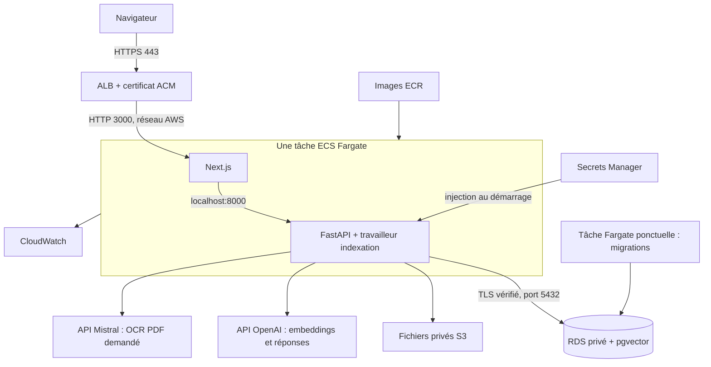

# Déployer Atelier sur AWS, étape par étape

**Le projet est préparé pour ECR + ECS Fargate + RDS PostgreSQL/pgvector + S3 + Secrets Manager + CloudWatch.** Le code et les tests sont fournis ; aucune ressource AWS n’a été créée pendant leur préparation. Les commandes `apply`, publication d’images et lancement ECS ci-dessous utilisent des services facturés.

En local, vous gardez **Ollama, `qwen3-embedding:0.6b` et `gemma4:e4b`**. Sur AWS, Terraform configure **l’API OpenAI** pour les embeddings et les réponses. **Mistral `mistral-ocr-latest`** reste facultatif, réservé aux PDF et déclenché à votre demande dans le Studio.

## 1. Comprendre les services

| Service | Explication simple | Configuration fournie |
|---|---|---|
| ECR | Range les images Docker | Deux dépôts privés : serveur et interface, tags de version non modifiables |
| ECS Fargate | Lance les conteneurs sans administrer un serveur Linux | Un service, une tâche de 0,5 vCPU / 2 Go contenant Next.js et FastAPI |
| RDS PostgreSQL | Gère la base et ses sauvegardes | PostgreSQL 17, db.t4g.micro, Single-AZ, 20 Go gp3, pgvector |
| S3 | Garde les fichiers originaux après remplacement des conteneurs | Bucket privé, chiffré et versionné ; anciennes versions supprimées après 30 jours |
| Secrets Manager | Conserve les clés hors du code | Un secret applicatif JSON et un secret administrateur RDS géré par AWS |
| CloudWatch | Rassemble les journaux et surveille les problèmes | Logs API/interface/RDS sur 7 jours, cinq alarmes |
| ALB | Fournit une porte d’entrée stable au site | HTTPS vers Next.js, vérification de santé, redirection HTTP vers HTTPS |
| ACM | Fournit le certificat HTTPS | Validation par un enregistrement DNS chez votre fournisseur de domaine |
| VPC + security groups | Définit le réseau et les portes autorisées | Deux zones ; base privée ; seul l’ALB entre dans l’interface |
| IAM | Définit les droits de chaque rôle | Exécution, accès S3 et préparation de la base séparés |
| SNS + AWS Budgets | Envoie les alertes par email | Budget 100 USD/mois, alertes 80 % réel et 100 % prévisionnel |



**Pour limiter le coût :** les tâches Fargate ont une IP publique pour leurs appels sortants. Leur pare-feu n’accepte le port 3000 que depuis l’ALB ; le port 8000 n’est pas ouvert. RDS n’a pas d’accès public. Cela évite le coût fixe d’un **NAT Gateway**. Un endpoint S3 de type **Gateway**, sans coût horaire, est fourni. Le DNS pointe vers l’ALB, jamais vers l’IP changeante d’une tâche.

Une tâche et une base Single-AZ conviennent à ce petit projet ; une panne peut provoquer une interruption. Ce n’est pas une configuration de haute disponibilité. Les fichiers et la file d’indexation restent dans S3/PostgreSQL lors du remplacement d’un conteneur.

## 2. Budget réaliste

Estimation **Paris (`eu-west-3`), 730 heures/mois**, vérifiée le **8 septembre 2026**, sans crédits AWS ni Free Tier :

| Poste | Hypothèse | USD HT/mois |
|---|---|---:|
| Fargate | 0,5 vCPU + 2 Go, une tâche | 25,48 |
| RDS calcul | db.t4g.micro, Single-AZ | 13,14 |
| RDS stockage | 20 Go gp3 | 2,66 |
| ALB | 730 h + 0,1 LCU moyenne estimée | 19,93 |
| IPv4 publiques | Minimum deux pour l’ALB + une pour Fargate | 10,95 |
| S3 | 1 Go, 1 000 écritures, 10 000 lectures | 0,03 |
| ECR | 2 Go d’images conservées | 0,20 |
| Secrets Manager | Deux secrets, 1 000 appels | 0,81 |
| CloudWatch | 1 Go de logs ingérés, rétention 7 jours, cinq alarmes | 1,11 |
| **Sous-total AWS estimé** | | **74,30** |
| OpenAI | 1 000 questions × 3 000 tokens entrée / 500 sortie ; 1 million de tokens à indexer | 0,77 |
| Mistral OCR | 100 pages envoyées, hors cache | 0,40 |
| **Total estimé** | | **75,47 USD HT** |

Ce n’est pas un plafond. Prévoyez une marge, par exemple **80 à 100 USD HT/mois**, hors domaine et taxes. AWS Budgets avertit ; il ne coupe pas automatiquement les ressources. OpenAI et Mistral se facturent séparément d’AWS.

Les tarifs régionaux calcul/stockage/ALB/logs sont référencés dans [`tarifs.json`](tarifs.json). Les [IPv4 coûtent 0,005 USD/heure](https://aws.amazon.com/vpc/pricing/), [ECR facture les images stockées](https://aws.amazon.com/ecr/pricing/) et [Secrets Manager facture les secrets et lectures](https://aws.amazon.com/secrets-manager/pricing/). Les sources IA figurent également dans le fichier de tarifs.

Hors estimation : domaine, éventuelle zone Route 53, transfert Internet/inter-AZ, CPU excédentaire RDS T4g, sauvegardes dépassant le volume inclus, recherches CloudWatch Logs Insights, SNS au-delà des franchises, analyses ECR avancées si activées dans le compte, appels vision/branching. Les déploiements doublent temporairement les tâches et ajoutent une IP ; l’ALB peut aussi utiliser davantage d’IP. Les versions S3/ECR comptent dans le stockage. Le petit bucket d’état Terraform entre dans votre volume S3 total.

Depuis la racine du projet :

```powershell
python scripts/estimer_cout.py
python scripts/estimer_cout.py --questions 100 --pages-ocr 0
python scripts/estimer_cout.py --go-ecr 5 --supplements 5
python scripts/estimer_cout.py --heures-fargate 100
```

La dernière commande réduit seulement le temps Fargate estimé : RDS et l’ALB restent payants.

## 3. Préparer le compte et l’ordinateur

Il faut un **sous-domaine dont vous contrôlez le DNS**, par exemple `rag.mondomaine.fr`. Gardez votre fournisseur DNS actuel : Route 53 n’est pas nécessaire. Le certificat ACM utilisé sur l’ALB ne demande pas d’achat de certificat. Réglez ce prérequis avant de créer le socle payant.

Activez la MFA du compte principal AWS, puis utilisez une identité dédiée au développement. Pour éviter une clé AWS permanente :

1. Dans **IAM Identity Center**, activez une instance d’organisation si vous n’en avez pas. AWS peut demander de créer AWS Organizations.
2. Créez votre utilisateur, terminez son inscription et configurez sa MFA.
3. Créez un **permission set** `AdministratorAccess` pour administrer ce compte d’apprentissage. Le déploiement crée du réseau, IAM, RDS et des budgets : des droits ECS seuls ne suffisent pas.
4. Dans **AWS accounts**, attribuez cet utilisateur et ce permission set au compte. Relevez l’URL du portail d’accès et la région d’Identity Center.
5. L’application utilisera ensuite ses propres rôles limités, sans droits administrateur ni clé AWS permanente.

[Guide AWS CLI avec IAM Identity Center](https://docs.aws.amazon.com/cli/latest/userguide/cli-configure-sso.html).

Installez **Docker Desktop**, **AWS CLI v2**, **Terraform ≥ 1.13.5** et **uv**. Gardez les outils déjà présents. Sous Windows :

```powershell
winget install --id Amazon.AWSCLI --exact
winget install --id Hashicorp.Terraform --exact
winget install --id astral-sh.uv --exact
```

Rouvrez PowerShell, démarrez Docker Desktop puis :

```powershell
cd D:\projet-pro\rag
aws --version
terraform version
docker version
uv sync --project serveur --frozen
aws configure sso --profile atelier
$env:AWS_PROFILE = "atelier"
$env:AWS_DEFAULT_REGION = "eu-west-3"
aws sso login --profile atelier
aws sts get-caller-identity
```

Dans `configure sso`, renseignez l’URL et la région du portail, puis choisissez votre compte et le rôle attribué. La région par défaut des services sera `eu-west-3` ; celle du portail SSO peut être différente. Vérifiez que `get-caller-identity` montre le bon compte. À chaque nouveau terminal, rétablissez `AWS_PROFILE` et reconnectez-vous si la session a expiré.

## 4. Conserver l’état Terraform dans S3

**Terraform** lit les fichiers `.tf`, montre ce qu’il va créer (`plan`), puis le crée (`apply`). Son **état** lui permet de retrouver les ressources. Un bucket S3 privé avec versions et verrouillage conserve cet état, indépendamment de votre PC. Il est distinct du bucket des documents.

Une seule fois, depuis la racine :

```powershell
$compte = aws sts get-caller-identity --query Account --output text
$bucketEtat = "atelier-rag-$compte-etat"
aws s3api create-bucket --bucket $bucketEtat --region eu-west-3 --create-bucket-configuration LocationConstraint=eu-west-3
aws s3api put-public-access-block --bucket $bucketEtat --public-access-block-configuration BlockPublicAcls=true,IgnorePublicAcls=true,BlockPublicPolicy=true,RestrictPublicBuckets=true
aws s3api put-bucket-versioning --bucket $bucketEtat --versioning-configuration Status=Enabled
Copy-Item deploiement/terraform/etat.s3.hcl.example deploiement/terraform/etat.s3.hcl
```

Ouvrez `deploiement/terraform/etat.s3.hcl` et remplacez le `bucket` par la valeur de `$bucketEtat`. S3 chiffre les nouveaux objets par défaut ; le backend demande aussi le chiffrement. `use_lockfile = true` empêche deux opérations Terraform simultanées. Ne supprimez pas ce bucket tant que l’infrastructure existe et ne partagez pas son contenu publiquement.

## 5. Créer le socle AWS

```powershell
Copy-Item deploiement/terraform/terraform.tfvars.example deploiement/terraform/terraform.tfvars
```

Ouvrez `terraform.tfvars`. Changez **`domaine` et `email_alertes`**. Gardez `region = "eu-west-3"`, `etape = "socle"` et les petites tailles proposées. Les fichiers personnels sont ignorés par Git. N’y mettez aucune clé API.

```powershell
terraform -chdir=deploiement/terraform init -backend-config=etat.s3.hcl
terraform -chdir=deploiement/terraform validate
terraform -chdir=deploiement/terraform plan -out=socle.tfplan
terraform -chdir=deploiement/terraform apply socle.tfplan
$config = terraform -chdir=deploiement/terraform output -json configuration | ConvertFrom-Json
$config.validation_dns | Format-Table
$config.cible_dns
```

Lisez le plan avant `apply` : **les créations facturées commencent ici**. RDS peut prendre plusieurs minutes. Aucun service applicatif ne démarre encore. Confirmez l’email SNS reçu pour activer les alarmes.

Chez votre fournisseur DNS :

| Type | Nom | Valeur |
|---|---|---|
| CNAME | Le `nom` de `validation_dns` | Sa `valeur` : validation ACM |
| CNAME | `rag`, pour `rag.mondomaine.fr` | `cible_dns` : adresse de l’ALB |

Certains fournisseurs ajoutent le domaine automatiquement : évitez de le répéter. Si un proxy est proposé, utilisez **DNS seul** pour cette première installation. Gardez le CNAME de validation pour les renouvellements. Attendez le statut **Issued** dans ACM, région Paris.

## 6. Enregistrer les clés privées

Préparez la clé OpenAI de votre projet API et, si souhaité, la clé Mistral pour les PDF. Choisissez une clé d’accès au site d’au moins 32 caractères, conservée dans votre gestionnaire de mots de passe. Le site propose un espace partagé protégé par cette clé, sans comptes individuels.

```powershell
uv run --project serveur python scripts/aws/configurer_secrets.py
```

La saisie est masquée. Le script envoie les valeurs directement à **Secrets Manager** et génère le mot de passe PostgreSQL applicatif. Entrée conserve une valeur existante ; Mistral peut rester vide. Mettre à jour les clés IA ne modifie pas le mot de passe PostgreSQL. Aucun secret n’est enregistré dans Terraform ou dans un fichier intermédiaire.

Le secret administrateur RDS, géré par AWS, est réservé à la préparation. Le serveur utilise le rôle PostgreSQL `atelier`, sans privilèges administrateur. ECS charge les secrets au démarrage : une mise à jour exige de nouvelles tâches. [Fonctionnement officiel](https://docs.aws.amazon.com/AmazonECS/latest/developerguide/specifying-sensitive-data-tutorial.html).

## 7. Publier les images et préparer la base

Faites passer les vérifications du README, puis choisissez un tag inédit :

```powershell
$version = "2026-09-08-01"
uv run --project serveur python scripts/aws/publier_images.py $version
```

Les deux images sont construites sur votre PC en **Linux/AMD64**, puis poussées vers ECR. Aucun modèle Ollama n’est inclus. L’autorisation ECR est temporaire ; aucune clé AWS n’est copiée dans les images.

Dans `terraform.tfvars`, mettez :

```hcl
etape = "preparation"
version_image = "2026-09-08-01"
version_preparation = "2026-09-08-01"
```

Puis :

```powershell
terraform -chdir=deploiement/terraform plan -out=preparation.tfplan
terraform -chdir=deploiement/terraform apply preparation.tfplan
uv run --project serveur python scripts/aws/preparer_base.py
```

La tâche ponctuelle crée le rôle applicatif, active `vector`, applique les migrations SQL puis s’arrête. **Attendez « Préparation réussie » avant de continuer.** Les migrations sont enregistrées en base et ne se rejouent pas à chaque démarrage.

## 8. Mettre le site en ligne

Une fois ACM **Issued** et la préparation réussie, changez seulement `etape = "application"` dans `terraform.tfvars` :

```powershell
terraform -chdir=deploiement/terraform plan -out=application.tfplan
terraform -chdir=deploiement/terraform apply application.tfplan
$config = terraform -chdir=deploiement/terraform output -json configuration | ConvertFrom-Json
Invoke-RestMethod "$($config.url)/api/sante"
Start-Process $config.url
```

Le service attend que FastAPI puis Next.js soient sains. Terraform attend sa stabilisation. Le circuit breaker ECS revient à la dernière version saine si un déploiement de remplacement échoue. Au tout premier lancement, aucune version saine de secours n’existe encore.

Connectez-vous, importez un petit fichier, générez l’aperçu, indexez et posez une question. Vérifiez le fichier dans S3 et les logs CloudWatch. Le health check vérifie l’API et PostgreSQL ; il ne valide pas les clés IA ou les droits S3.

La bibliothèque AWS commence vide. Pour ce petit projet, réimportez vos fichiers puis réindexez avec OpenAI. **Les embeddings Qwen et OpenAI ne sont jamais mélangés.** La bibliothèque et le `.env` de votre PC restent locaux.

## 9. Retrouver l’état et les journaux

Depuis la racine, dans une session AWS connectée :

```powershell
$config = terraform -chdir=deploiement/terraform output -json configuration | ConvertFrom-Json
aws ecs describe-services --cluster $config.cluster --services $config.service --query "services[0].{etat:status,actives:runningCount,attendues:desiredCount,evenements:events[0:5]}"
aws logs tail $config.journaux --since 30m
aws logs tail $config.journaux --follow
```

`Ctrl+C` arrête le suivi sur votre PC. Après modification des clés par `configurer_secrets.py`, rechargez-les :

```powershell
aws ecs update-service --cluster $config.cluster --service $config.service --force-new-deployment --query "service.serviceName"
aws ecs wait services-stable --cluster $config.cluster --services $config.service
```

Dans AWS Console, les noms commencent par `atelier-rag`. Logs : `/ecs/atelier-rag` et `/aws/rds/instance/atelier-rag/postgresql`. Les sorties Terraform donnent les noms exacts si vous changez le préfixe.

## 10. Mettre à jour et revenir en arrière

1. Vérifiez le code et [sauvegardez RDS](sauvegarder-restaurer-aws.md) avant une migration importante.
2. Publiez un nouveau tag : `uv run --project serveur python scripts/aws/publier_images.py 2026-09-09-01`.
3. Gardez `etape = "application"` et l’ancienne `version_image`. Changez seulement `version_preparation = "2026-09-09-01"`.
4. Préparez puis appliquez cette modification :

```powershell
terraform -chdir=deploiement/terraform plan -out=migration.tfplan
terraform -chdir=deploiement/terraform apply migration.tfplan
uv run --project serveur python scripts/aws/preparer_base.py
```

5. Si la préparation réussit, changez `version_image = "2026-09-09-01"`. Faites un nouveau `plan` puis `apply` pour remplacer le service.
6. Vérifiez import, indexation, réponse et sources.

**Après la première mise en ligne, ne revenez pas à `etape = "preparation"` ou `socle` : cela retire le service.** `version_preparation` permet de migrer tout en gardant l’ancienne application. Écrivez des migrations compatibles avec elle : ajouter les nouveaux champs, migrer les usages, supprimer l’ancien dans une livraison ultérieure. Lors de la première mise à jour depuis l’ancienne version locale, terminez les indexations avant de redémarrer.

Pour revenir au code précédent, remettez son tag dans `version_image`, puis `plan` et `apply`. Les images taguées restent dans ECR. Cela **n’annule pas les migrations SQL** : une migration destructive peut demander une restauration de base, avec interruption et perte d’écritures plus récentes. Après un rollback automatique ECS, remettez le tag sain dans Terraform avant le prochain déploiement.

## 11. Arrêter et maîtriser les dépenses

Pour couper le site en gardant les données, mettez `nombre_taches = 0`, puis `plan` et `apply`. **RDS, ALB, ses deux IP, les secrets et le stockage restent facturés.** Remettez `1` pour relancer.

RDS peut être arrêté temporairement dans la console, mais AWS le redémarre après sept jours ; le stockage reste facturé. [Règle AWS](https://docs.aws.amazon.com/AmazonRDS/latest/UserGuide/USER_StopInstance.html). Pour supprimer définitivement, suivez le [guide de sauvegarde/restauration](sauvegarder-restaurer-aws.md#supprimer-linstallation). Les snapshots, buckets et domaines conservés peuvent continuer à coûter.

## 12. Dépannage

| Symptôme | Vérification |
|---|---|
| AccessDenied | Identité STS, profil SSO, permission set, restrictions du compte |
| Certificat bloqué | CNAME exact, domaine, région Paris, propagation DNS |
| CannotPullContainerError | Image/tag ECR, architecture AMD64, rôle d’exécution, réseau sortant |
| ResourceInitializationError | Valeurs JSON du secret, rôle IAM de la bonne tâche, Internet sortant |
| Préparation échouée | Logs du conteneur preparation, RDS disponible, port 5432, certificat TLS ; ne poursuivez pas |
| ALB 503 | Événements ECS, conteneurs sains, listener HTTPS et groupe cible |
| PostgreSQL refuse la connexion | Subnets privés, SG application → base, secret applicatif préparé |
| Erreur TLS PostgreSQL | Nom DNS RDS, verify-full et bundle rds.pem à jour |
| Sortie 137 | Mémoire insuffisante : réduire les imports simultanés ou augmenter RAM et budget |
| OpenAI 401 / 429 | Clé, crédits et quotas du projet OpenAI ; budget indépendant d’AWS |
| S3 AccessDenied | Rôle application, bon bucket/région et politique du bucket |
| Indexation après redémarrage | Reprise après expiration du bail (90 s) ; après trois interruptions, relancer dans le Studio |
| Chat interrompu au déploiement | Recharger l’historique et relancer la question ; le streaming n’est pas une tâche durable |
| Quota Fargate nul | Service Quotas → Fargate On-Demand vCPU ; prévoir au moins 1,25 vCPU pour migration + deux tâches pendant remplacement |

L’OCR est verrouillé entre tâches et mis en cache après réponse. Un arrêt brutal après facturation Mistral mais avant sauvegarde du cache peut imposer un nouvel appel. Les embeddings peuvent également être recalculés après interruption : aucune garantie « exactement une fois » n’est annoncée pour les services IA externes.

## Les fichiers à connaître

| À modifier | Fichier |
|---|---|
| Domaine, région, version, nombre de tâches | Votre `deploiement/terraform/terraform.tfvars` |
| Réseau et ports | [`reseau.tf`](../deploiement/terraform/reseau.tf) |
| ECR, S3 et RDS | [`donnees.tf`](../deploiement/terraform/donnees.tf) |
| Conteneurs, CPU/RAM, HTTPS | [`application.tf`](../deploiement/terraform/application.tf) |
| Droits IAM | [`permissions.tf`](../deploiement/terraform/permissions.tf) |
| Alarmes et budget | [`supervision.tf`](../deploiement/terraform/supervision.tf) |
| Préparation PostgreSQL | [`preparer.py`](../serveur/application/base/preparer.py) et [`migrations`](../serveur/application/base/migrations) |
| Reprise des indexations | [`travaux.py`](../serveur/application/services/travaux.py) |

Les [tests Terraform](../deploiement/terraform/tests/architecture.tftest.hcl) utilisent AWS simulé. Ils ne remplacent pas un déploiement réel : quotas, connexion RDS TLS, certificat public, performances et restauration devront être confirmés dans votre compte.
