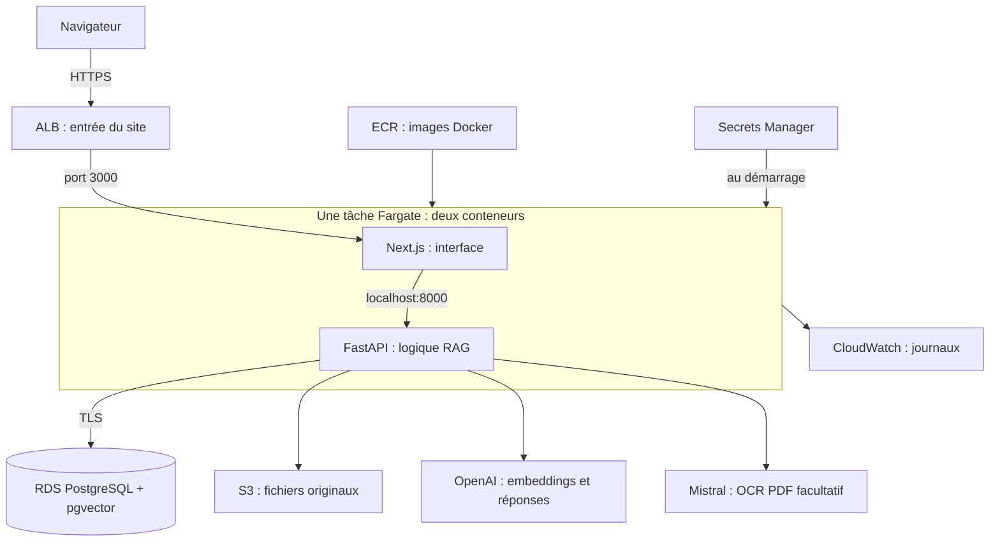

# Apprendre AWS en installant Atelier à la main

**Vous créez vous-même les ressources dans la console AWS, une étape à la fois. Aucun Terraform n’est nécessaire.** Ce parcours part de zéro en cloud. Les commandes du terminal sont expliquées, et chaque chapitre se termine par une vérification et une consigne de fin de séance.

Si les mots VPC, RDS ou ECS sont encore abstraits, commencez par **[AWS expliqué très simplement](aws-explique-tres-simplement.md)**. Ce petit document raconte les six premières étapes avec l’image d’une école, avant les réglages techniques.

Votre objectif est d’apprendre, pas de garder un site allumé tout le mois. Commencez par les étapes sans calcul facturé à l’heure. Créez RDS et Fargate lorsque vous avez du temps pour les tester, puis suivez systématiquement la fiche d’arrêt.

## Le parcours

Les durées sont des repères de lecture et de manipulation, pas des délais garantis. Vous pouvez étaler le parcours sur plusieurs jours. RDS, le téléchargement des images et le DNS peuvent demander une attente supplémentaire.

| Chapitre | Ce que vous comprenez et réalisez | Durée indicative |
|---|---|---|
| [1. Comprendre et préparer](apprendre-aws/01-comprendre-et-preparer.md) | Compte, région, AZ, console, IAM, budget, terminal | 45–60 min |
| [2. Construire le réseau](apprendre-aws/02-creer-le-reseau.md) | VPC, subnets, routes, Internet Gateway, security groups | 45–60 min |
| [3. Ranger les documents et les images](apprendre-aws/03-stocker-et-publier.md) | S3, ECR, différence fichier/image/conteneur, publication Docker | 30–60 min |
| [4. Créer la base et les secrets](apprendre-aws/04-base-et-secrets.md) | RDS, PostgreSQL, pgvector, mots de passe et Secrets Manager | 30–45 min + création RDS |
| [5. Autoriser puis préparer l’application](apprendre-aws/05-roles-et-preparation.md) | Rôles IAM, logs, cluster ECS, tâche de migration ponctuelle | 45–60 min |
| [6. Mettre le site en ligne](apprendre-aws/06-mettre-le-site-en-ligne.md) | Domaine, certificat, ALB, task definition et service Fargate | 45–60 min + DNS |
| [7. Observer et mettre à jour](apprendre-aws/07-observer-et-modifier.md) | CloudWatch, alarmes, nouvelle version, diagnostic | 30–45 min |
| [8. Finir une séance](apprendre-aws/08-arreter-reprendre-supprimer.md) | Arrêter, reprendre, supprimer et vérifier les coûts restants | À garder ouvert à chaque séance |
| [9. Calculer le coût des séances](apprendre-aws/09-budget-des-seances.md) | Coût horaire, stockage conservé, exemples de 4 h et 8 h/mois | 15 min |

**Première séance conseillée : chapitres 1 et 2 seulement.** Vous apprenez déjà IAM et le réseau sans créer de machine RDS, de tâche Fargate ou de load balancer. Il n’est pas nécessaire de terminer toute l’installation le même jour.

## Ce que vous allez construire

L’application reste identique en local : **Ollama avec `qwen3-embedding:0.6b` et `gemma4:e4b`**. Sur AWS, vous sélectionnez OpenAI. Les fichiers AWS sont dans S3 et les données dans RDS ; remplacer un conteneur ne les efface pas. Les indexations disposent d’une file PostgreSQL pour reprendre après interruption.

## Votre matériel de cours

- [`configuration.exemple.json`](../deploiement/aws/configuration.exemple.json) : un carnet pour noter les identifiants, sans mots de passe.
- [`tache-preparation.exemple.json`](../deploiement/aws/tache-preparation.exemple.json) : une fiche ECS qui prépare les tables.
- [`tache-application.exemple.json`](../deploiement/aws/tache-application.exemple.json) : une fiche ECS pour les deux conteneurs.
- [`estimer_cout.py`](../scripts/estimer_cout.py) : une calculatrice locale, sans appel AWS.
- [Sauvegarder et restaurer](sauvegarder-restaurer-aws.md) : à lire avant de supprimer des données utiles.

Les fichiers JSON ECS sont le format natif de l’API AWS : ils décrivent les paramètres visibles dans la console. Vous les lisez, remplissez et enregistrez vous-même. Ils ne créent ni réseau, ni base, ni service à votre place. Les scripts Python AWS sont des raccourcis **facultatifs**, présentés après les opérations manuelles et dans le [mode d’emploi des modèles](../deploiement/aws/README.md).

## Comment travailler avec ce guide

Lisez « ce que cela signifie » avant de cliquer. Recopiez les noms proposés pour retrouver facilement vos ressources. À la fin de chaque étape, vérifiez le résultat avant de poursuivre. Si un point reste obscur, faites une pause : les checkpoints sont justement là pour éviter de cumuler des erreurs.

Les intitulés anglais entre parenthèses correspondent aux boutons AWS. Leur position peut évoluer ; le service, la ressource et le réglage à chercher sont précisés. Références AWS vérifiées le **8 septembre 2026**. Les modèles JSON et scripts sont contrôlés localement ; les clics et commandes de création n’ont pas été exécutés dans votre compte, et aucun coût AWS n’a été engagé pour écrire ce cours.

L’ancien parcours automatisé est conservé dans [l’historique GitHub](https://github.com/AmauryLeChaffotec/atelier-rag/tree/d95e892/deploiement/terraform). Il n’intervient dans aucune des étapes de ce cours.
