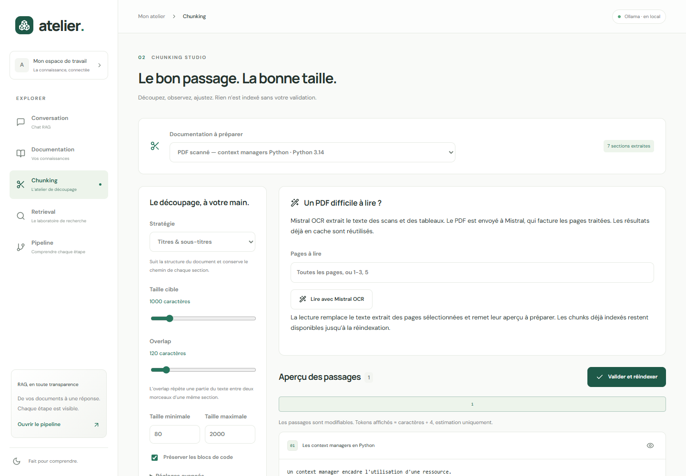

# Lire les PDF avec Mistral OCR

Un PDF contient parfois du vrai texte, parfois seulement des images de pages scannées. Dans le second cas, un OCR reconnaît les lettres et reconstruit du texte exploitable pour le RAG.

Atelier commence par une extraction locale avec PyMuPDF. **Mistral OCR est une option dédiée aux PDF**, utile si le texte est absent, mal ordonné ou difficile à lire. Le modèle demandé est `mistral-ocr-latest`. Le chat continue d’utiliser Gemma en local et les embeddings Qwen ; sur AWS, ces deux fonctions passeront à OpenAI.

## 1. Configurer une fois

Dans `.env`, à la racine du projet :

```dotenv
MISTRAL_API_KEY=VOTRE_CLE_PRIVEE_MISTRAL
MISTRAL_OCR=mistral-ocr-latest
```

Puis, depuis la racine :

```powershell
docker compose up -d --build --wait
```

La clé n’est jamais transmise au navigateur. `.env` est ignoré par Git. Les fichiers `.env.example` du dépôt contiennent seulement des champs vides.

## 2. Lire un PDF



1. Dans **Documentation**, importez le PDF et renseignez technologie, version et titre.
2. Ouvrez ce document dans **Chunking**.
3. Dans **Un PDF difficile à lire ?**, laissez les pages vides pour tout lire, ou indiquez `1-3, 5` pour les pages 1, 2, 3 et 5.
4. Cliquez **Lire avec Mistral OCR**. Cette action envoie le PDF à Mistral, avec la sélection des pages à traiter.
5. Consultez **les sections extraites et le document original**. Vérifiez notamment le code, les chiffres et les tableaux.
6. Cliquez **Générer l’aperçu**, corrigez les chunks si nécessaire, puis **Valider et indexer**.

Le PDF d’origine reste disponible. L’OCR remplace les sections des pages sélectionnées, conserve les autres pages et les descriptions visuelles validées, puis efface le brouillon de chunking pour vous inviter à le préparer de nouveau. Les anciens chunks indexés restent interrogeables jusqu’à la réindexation.

Le [PDF scanné d’exemple](../interface/public/exemple-pdf-scanne.pdf) ne contient pas de couche texte : il permet de constater concrètement l’apport de l’OCR sur une seule page.

## 3. Comprendre le coût et le cache

Au tarif vérifié le **8 septembre 2026**, l’OCR standard associé à `mistral-ocr-latest` coûte **4 USD pour 1 000 pages**, hors taxes : une page vaut 0,004 USD, 100 pages valent 0,40 USD. Cette application ne demande pas les annotations Document AI, qui ont un tarif distinct. [Tarification Mistral](https://mistral.ai/pricing/api/).

Le texte reconnu est conservé **par document, modèle demandé et page** dans PostgreSQL. Relire la même page utilise ce cache. Une sélection qui contient des pages déjà lues envoie seulement les pages manquantes à traiter. Réimporter le même PDF crée un autre document et un autre cache. Changer `MISTRAL_OCR` invalide le cache pour la nouvelle sélection.

`latest` est un alias susceptible d’évoluer chez Mistral. L’application conserve le nom retourné par l’API pour chaque page ; le cache existant n’est pas automatiquement recalculé quand l’alias évolue. Pour une expérience reproductible, vous pourrez configurer un identifiant de version explicite disponible dans votre compte.

```powershell
python scripts/estimer_cout.py --questions 1000 --pages-ocr 100
```

## 4. Ce que l’OCR ne remplace pas

L’OCR extrait du texte et de la structure. Un diagramme peut revenir sous forme d’image sans explication de ses flèches. Dans ce cas, ouvrez la page et rédigez une description dans le Studio. Les pages visuelles restent liées aux chunks pour vérification.

Un appel réel a été vérifié sur un PDF scanné d’une page : reconnaissance du texte, preview, embeddings Qwen, indexation pgvector et retrieval. Une seconde lecture a utilisé le cache. Cela ne garantit pas la qualité sur tous les scans, tableaux ou écritures manuscrites.

## 5. Où se trouve le code ?

- [`services/ocr.py`](../serveur/application/services/ocr.py) : appel HTTP Mistral, sélection de pages, cache et conversion en sections.
- [`002_ocr.sql`](../serveur/application/base/migrations/002_ocr.sql) : colonne PostgreSQL qui conserve le cache.
- [`studio.tsx`](../interface/composants/studio.tsx) : bouton OCR et saisie des pages.
- [`test_ocr.py`](../serveur/tests/test_ocr.py) : contrat HTTP simulé et conservation de la structure.

L’intégration utilise directement l’[API OCR officielle](https://docs.mistral.ai/studio/document-processing/basic_ocr), sans SDK supplémentaire.
